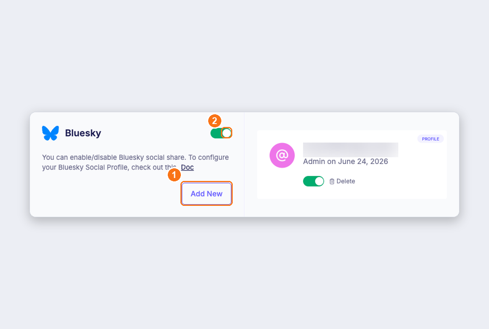
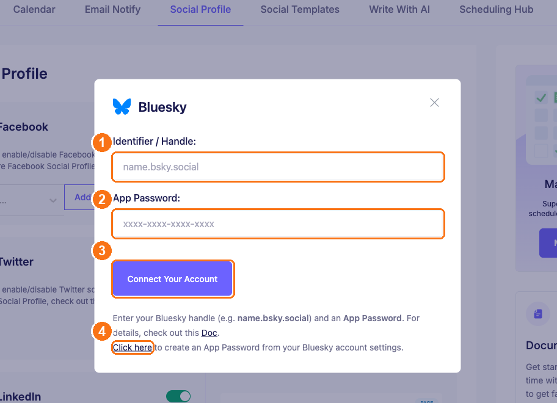
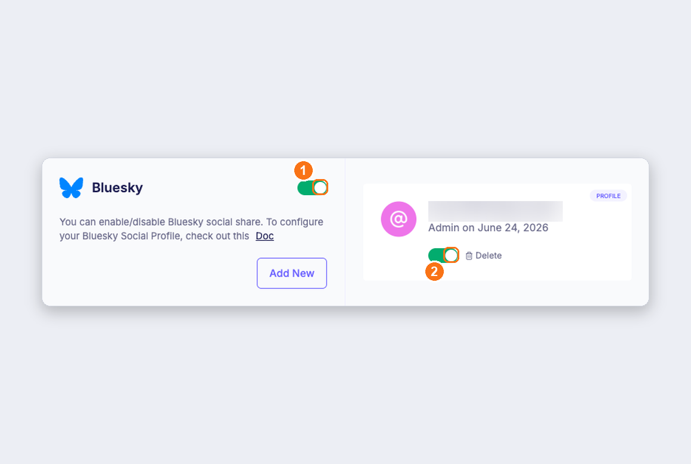
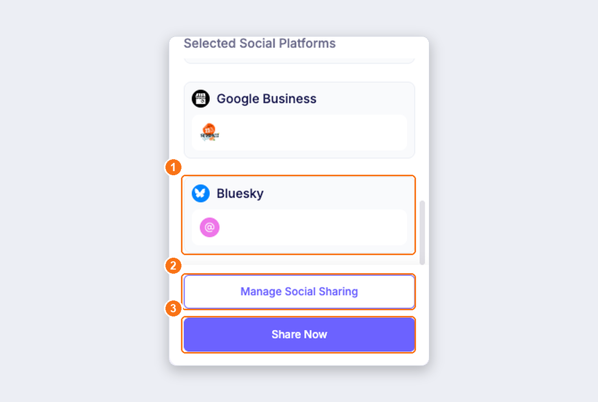
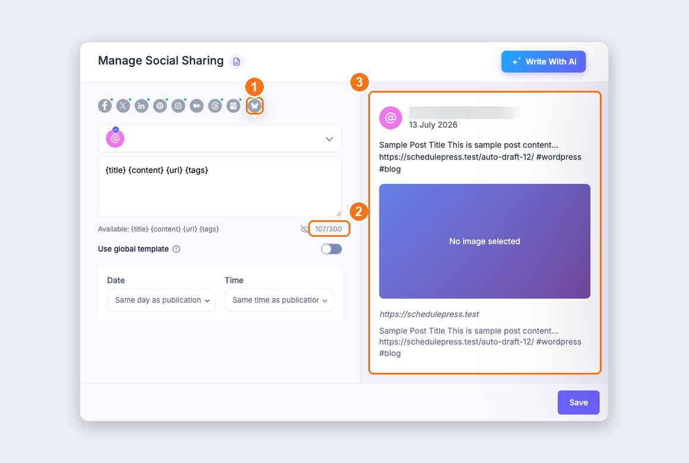
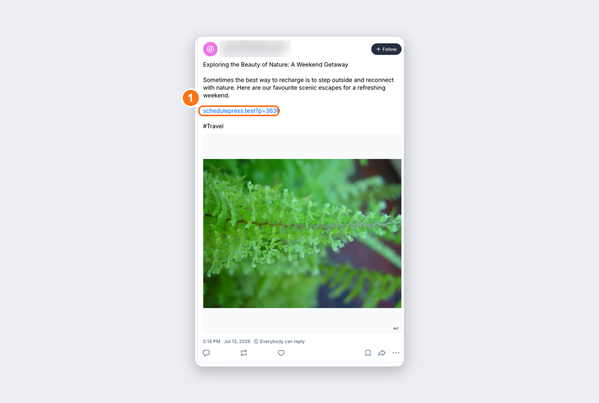

# How to Automatically Share WordPress Posts on Bluesky with SchedulePress

SchedulePress lets you **automatically share your WordPress posts on Bluesky** the moment they publish, or push them out instantly with **Share Now** — no manual copy‑pasting into the Bluesky app.

Unlike most networks, Bluesky doesn't need an OAuth app or developer portal. You connect with just two things: your **handle** (e.g. `name.bsky.social`) and an **App Password** generated from your own Bluesky account. This guide walks through the whole process, step by step.

> **Good to know**
> - Bluesky connection is available in both **Free** and **Pro**. Free allows **one profile per network**; **Pro** unlocks **unlimited profiles**.
> - Bluesky enforces a **300‑character** limit per post. SchedulePress shows a live counter and trims your template to fit.
> - You authenticate with an **App Password**, *not* your main Bluesky login password — you can revoke it any time without changing your account password.

> The numbered markers (①②③…) in each screenshot below match the numbered steps in the text.

---

## Step 1: Create a Bluesky App Password

An **App Password** is a limited credential that lets third‑party tools (like SchedulePress) post on your behalf, without exposing your real account password.

1. Log in to your Bluesky account and go to **[https://bsky.app/settings/app-passwords](https://bsky.app/settings/app-passwords)** (**Settings → Privacy and Security → App Passwords**).
2. Click **Add App Password**, give it a recognizable name (for example, `SchedulePress`), and confirm.
3. Bluesky shows a password in the format `xxxx-xxxx-xxxx-xxxx`. **Copy it now** — it's shown only once.

> ⚠️ Keep this App Password safe. If you ever lose it or want to disconnect, just delete it from the same Bluesky screen and the connection stops working immediately.

---

## Step 2: Open the Bluesky Social Profile in SchedulePress

In your WordPress dashboard, go to **SchedulePress → Settings → Social Profile** and scroll down to the **Bluesky** card.

- **①** Click the **Add New** button to open the connection window.
- **②** Make sure the Bluesky **network toggle** is switched **ON**.

---

## Step 3: Connect Your Bluesky Account

In the **Bluesky** connect window, fill in the two fields and connect:

- **①** **Identifier / Handle** — your full Bluesky handle, e.g. `name.bsky.social`.
- **②** **App Password** — the `xxxx-xxxx-xxxx-xxxx` password you generated in **Step 1**.
- **③** Click **Connect Your Account**.
- **④** No App Password yet? The **Click here** link jumps straight to the Bluesky App Passwords page.

---

## Step 4: Enable the Profile & Save

Once connected, your Bluesky profile appears as a card on the right, tagged **PROFILE**. Make sure both toggles are **ON**, then click **Save Changes** at the bottom of the page:

- **①** The **network toggle** on the Bluesky card.
- **②** The **profile toggle** on the connected account.

That's it — your Bluesky account is now connected and enabled. Every post you publish can now be shared to Bluesky automatically.

---

## Step 5: Share Your Posts on Bluesky

Open any post in the editor and expand the **SchedulePress → Schedule And Share** panel. Under **Social Share Settings → Selected Social Platforms**:

- **①** **Bluesky** (with your `*.bsky.social` profile) is listed alongside your other connected networks.
- **②** **Manage Social Sharing** — fine‑tune the caption per network.
- **③** **Share Now** — push the post to Bluesky instantly, without waiting for publish/schedule.

When the post is published (immediately or on schedule) it's **auto‑shared** to your enabled Bluesky profile. Click **Manage Social Sharing** and select the **Bluesky** tab to control exactly what goes out:

- **①** The **Bluesky** tab (butterfly icon).
- **②** A live **300‑character** counter — Bluesky's limit.
- **③** A **live preview** of precisely how the post will look on your Bluesky timeline before it's shared.

> **Tip:** Control the wording of your Bluesky posts under **Settings → Social Templates** using tokens like `{title}`, `{content}`, `{url}`, and `{tags}`. Because Bluesky's limit is **300 characters**, keep the template short — the live counter warns you before you exceed it.

---

## Final Outcome

Once a post is published or shared, it appears automatically on your Bluesky timeline — with your chosen title, content, link, hashtags, and featured image. Below is a real post shared from SchedulePress to a connected Bluesky account — **①** notice the source link back to the WordPress site:

That's the whole loop: publish in WordPress → SchedulePress posts it to Bluesky → your audience sees it, no manual steps.

---

## Troubleshooting

- **"Authentication failed" / can't connect** — double‑check the handle is the full `name.bsky.social` form and that the **App Password** was copied correctly (no leading/trailing spaces). Regenerate a fresh App Password if needed.
- **Post didn't share to Bluesky** — confirm both the **network toggle** and the **profile toggle** are ON, that the post isn't set to **Disable Social Share**, and that Bluesky is included in **Manage Social Sharing** for that post.
- **Sharing suddenly stopped** — the App Password may have been revoked or expired on Bluesky. Delete the profile in SchedulePress and reconnect with a new App Password.
- **Text looks cut off** — Bluesky allows only 300 characters; shorten your social template.

---

## Related Docs

- [Connecting Social Accounts (all platforms)](../SOCIAL-SETUP.md)
- [Automatically Share WordPress Posts on Threads](https://wpdeveloper.com/docs/automatically-share-wordpress-posts-on-threads/)
- [SchedulePress Documentation](https://wpdeveloper.com/docs-category/wp-scheduled-posts/)

Still stuck? [Get support from WPDeveloper](https://wpdeveloper.com/support/).
